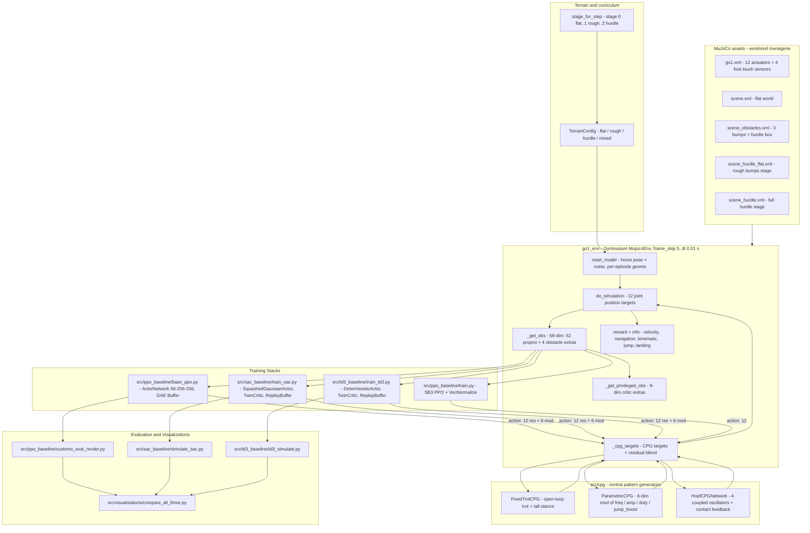
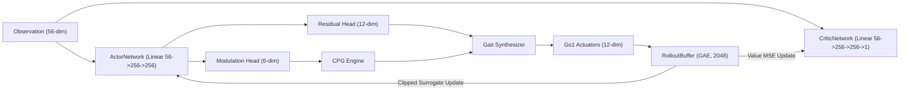
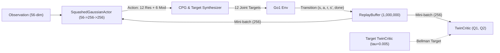
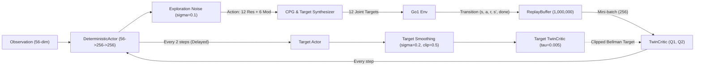
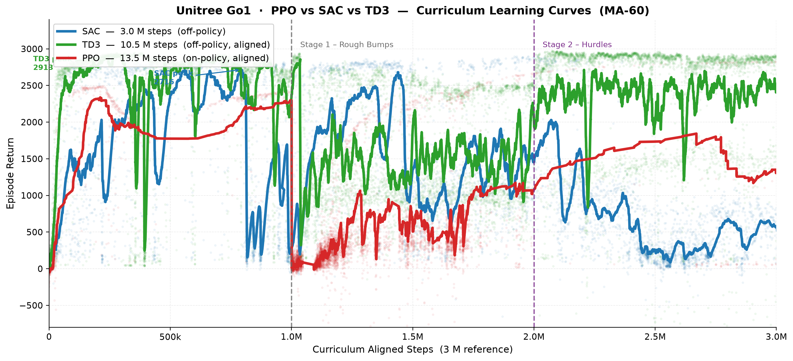

# deep-rl-and-cpg-ws

Deep-RL + CPG locomotion stack for the **Unitree Go1** quadruped in MuJoCo: an obstacle-aware Gymnasium environment, an automated three-stage curriculum (**flat → rough bumps → hurdles**), and hybrid controllers pairing a Central Pattern Generator (CPG) with three reinforcement learning baselines: **PPO**, **SAC**, and **TD3**.

<p align="center">
  
</p>

> [!NOTE]
> Primary locomotion demonstration shown above using `media/gif/go1_walking.gif`. Additional stage-specific and per-algorithm rollout GIFs will be added in upcoming releases.

Four runnable training stacks are provided:

| Stack | Implementation Directory | Algorithm Type | Action Space | Primary Role | Key Checkpoints |
| :--- | :--- | :--- | :--- | :--- | :--- |
| **PPO Baseline** | `src/ppo_baseline/base_ppo.py` | On-policy Policy Gradient | 18-dim / 12-dim | Clipped surrogate + GAE buffer + CPG modulation | `ppo_checkpoint_latest.pth` |
| **SAC Baseline** | `src/sac_baseline/train_sac.py` | Off-policy Max-Entropy Actor-Critic | 18-dim / 12-dim | Maximum entropy exploration + 1M replay buffer | `src/sac_baseline/checkpoints/` |
| **TD3 Baseline** | `src/td3_baseline/train_td3.py` | Off-policy Deterministic Actor-Critic | 18-dim / 12-dim | Clipped Double Q + Target Policy Smoothing | `src/td3_baseline/checkpoints/` |
| **SB3 Baseline** | `src/ppo_baseline/train.py` | Stable-Baselines3 PPO | 12-dim | Vectorized reference benchmark (`VecNormalize`, CPG off) | `src/checkpoints/your_run_name/` |

---

## System architecture



<details>
<summary>Plain-text version of the architecture diagram</summary>

```text
        mujoco_menagerie/unitree_go1                    src/cpg  (mode select)
 ┌────────────────────────────────────────┐      ┌───────────────────────────────────────┐
 │ go1.xml    12 actuators, 4 touch feet  │      │ FixedTrotCPG    open-loop trot        │
 │ scene.xml  flat / hurdle / obstacles   │      │ ParametricCPG   6-dim mod             │
 └────────────────┬───────────────────────┘      │ HopfCPGNetwork  4 oscillators + fb    │
                  │                              └────────────────┬──────────────────────┘
                  │ xml_file / terrain_config                     │ 12 joint targets
                  v                                               v
 ┌───────────────────────────────────────────────────────────────────────────────────────┐
 │ src/go1_env.py  go1_env(Gymnasium MujocoEnv, frame_skip=5, dt=0.01 s)                 │
 │   reset_model(): home pose + noise, _reposition_hurdle() / _reposition_bumps()        │
 │   step(): _cpg_targets(action) -> do_simulation() -> reward + info                    │
 │   _get_obs(): 56-dim (52 proprio + 4 hurdle)    _get_privileged_obs(): 9-dim extras    │
 └────────────┬────────────────────────────────────────────────────┬─────────────────────┘
              │ obs (56-dim)                                       │ obs (56-dim)
              v                                                    v
 ┌───────────────────────────────────────┐      ┌────────────────────────────────────────┐
 │ src/ppo_baseline/base_ppo.py (PPO)    │      │ src/sac_baseline/train_sac.py (SAC)    │
 │  Actor 56->256->256 (Gaussian)        │      │  SquashedGaussianActor (Max-Entropy)   │
 │  GAE RolloutBuffer (2048 steps)       │      │  TwinCritic + ReplayBuffer (1M steps)  │
 └───────────────────────────────────────┘      └────────────────────────────────────────┘
              │                                                    │
              v                                                    v
 ┌───────────────────────────────────────┐      ┌────────────────────────────────────────┐
 │ src/td3_baseline/train_td3.py (TD3)   │      │ src/visualizations/compare_all_three.py│
 │  DeterministicActor + Target Smoothing│      │  Comprehensive 3-Way Benchmark Suite   │
 │  Delayed Policy Updates (d=2)         │      │  Side-by-side curves & stage analysis  │
 └───────────────────────────────────────┘      └────────────────────────────────────────┘
```

</details>

### Dataflow summary
1. **Assets & Physics** — Vendored Go1 model (12 actuators, 4 foot touch sensors); MuJoCo step runs at 100 Hz (`dt = 0.01 s`, `frame_skip = 5`).
2. **Terrain & Dynamic Curriculum** — `TerrainConfig` programmatically selects scene XMLs and randomizes bump heights and hurdle locations on each reset.
3. **State Observation** — Ingests a 56-dimensional vector (torso height/orientation, joint positions/velocities, gravity vector, previous actions, and hurdle-relative distances).
4. **CPG Modulation** — The CPG layer supplies a rhythmic nominal trot; RL policies output joint residuals and 6 gait modulation parameters (frequency, amplitude, duty factor, jump tuck).
5. **Multi-Algorithm Training** — Modular baseline stacks for PPO, SAC, and TD3 with checkpointing and TensorBoard logging.
6. **Evaluation & Verification** — Dedicated HUD renderers generate rollout GIFs and comparative performance dashboards.

---

## Algorithm deep dives: behaviour, convergence & stage performance

### 1. Proximal Policy Optimization (PPO with CPG)

*Source: `src/ppo_baseline/` ([`base_ppo.py`](file:///home/plsh/rl_env2/src/ppo_baseline/base_ppo.py), [`README.md`](file:///home/plsh/rl_env2/src/ppo_baseline/README.md))*



#### Algorithmic behaviour & mechanics
- **Policy formulation**: On-policy policy gradient method using clipped surrogate objective ($L^{\text{CLIP}}(\theta)$, with $\epsilon = 0.2$, decaying to $0.15$ in hurdle stages).
- **Network structure**: Shared trunk `Linear(56 → 256) → Tanh → Linear(256 → 256) → Tanh` feeding dual heads: a 12-dim residual head and a 6-dim CPG modulation head (`[d_freq, d_thigh_amp, d_calf_amp, d_phase_offset, duty, jump_boost]`).
- **Exploration & updates**: Stochastic Gaussian policy with state-independent learned log standard deviation and entropy bonus. Advantage estimation is computed using Generalized Advantage Estimation ($\text{GAE}(\gamma=0.99, \lambda=0.95)$) across 2048-step rollout buffers over 5 epochs with minibatch size 64.
- **Data retention**: Being strictly on-policy, all trajectories are discarded after each batch update, requiring fresh interactions for every gradient calculation.

#### Convergence dynamics
- **Sample efficiency footprint**: Slower initial progress than off-policy methods, requiring ~13.5M environment steps (equivalent to ~3.0M scaled curriculum steps) to complete all three stages.
- **Optimization stability**: Avoids Q-value overestimation and divergence risks. Once initial diagonal trot synchronization is established, returns progress monotonically without catastrophic forgetting.

#### Stage-by-stage performance
- **Stage 0 (Flat Ground)**: Mean return **323.54**. Takes ~1.2M raw steps (~144k aligned) to acquire upright balance and reach the $\ge 2,000$ return milestone. Early exploration is cautious as joint residuals calibrate against the open-loop CPG prior.
- **Stage 1 (Rough Bumps)**: Mean return **273.88**. Encounters difficulty with early terminations from unpredicted foot collisions over bumps; on-policy data discarding slows adaptation to sudden elevation changes.
- **Stage 2 (Hurdles)**: Mean return **1,531.31** (peak return **2,824.63**). Shows strong late-stage recovery as the policy learns to modulate `jump_boost` and tuck diagonal pairs symmetrically to clear hurdles.

---

### 2. Soft Actor-Critic (SAC with CPG)

*Source: `src/sac_baseline/` ([`sac_agent.py`](file:///home/plsh/rl_env2/src/sac_baseline/sac_agent.py), [`train_sac.py`](file:///home/plsh/rl_env2/src/sac_baseline/train_sac.py), [`README.md`](file:///home/plsh/rl_env2/src/sac_baseline/README.md))*



#### Algorithmic behaviour & mechanics
- **Policy formulation**: Off-policy maximum-entropy actor-critic optimizing cumulative return augmented by policy entropy: $\mathcal{J}(\pi) = \mathbb{E}[\sum_t \gamma^t (r_t + \alpha \mathcal{H}(\pi(\cdot|s_t)))]$.
- **Network structure**: `SquashedGaussianActor` (`56 → 256 → 256 → Mean/LogStd`) outputting continuous actions bounded in $[-1, 1]$ via Tanh squashing.
- **Critic & value stabilization**: `TwinCritic` (two separate networks $Q_1, Q_2$, each taking state + 18-dim action) mitigating positive value overestimation via Clipped Double Q-learning: $y = r + \gamma \min(Q_1', Q_2') - \alpha \log \pi(a'|s')$.
- **Replay & temperature**: 1,000,000-transition circular `ReplayBuffer` sampled in mini-batches of 256. Automatic entropy temperature adjustment balances exploratory foot placement with exploitative locomotion. Transitions are preserved across stage boundaries.

#### Convergence dynamics
- **Sample efficiency footprint**: Reaches $\ge 2,000$ return in only **124,017 steps** (~1.2× faster than PPO) and $\ge 2,500$ in **272,676 steps**.
- **Data reuse**: Continuous gradient updates per environment step (1 update per step) enable rapid bootstrapping from stored experience.
- **Entropy scheduling**: Temperature $\alpha$ begins elevated, encouraging broad foot placement exploration over uneven ground before settling into an efficient forward trot.

#### Stage-by-stage performance
- **Stage 0 (Flat Ground)**: Mean return **2,275.55** (highest among all three algorithms). Achieves full 1,000-step survival within ~240k steps. The stochastic maximum-entropy formulation efficiently discovers energetic forward gaits.
- **Stage 1 (Rough Bumps)**: Mean return **1,620.16** (highest on rough terrain). Smoothly accommodates surface bumps with minimal drop in survival rate, using entropy-driven foot compliance.
- **Stage 2 (Hurdles)**: Mean return **1,691.19** with a peak evaluation return of **2,917.71** (0% fall rate at peak). Retaining the 1M replay buffer enables rapid adaptation to hurdle clearance.

---

### 3. Twin Delayed Deep Deterministic Policy Gradient (TD3 with CPG)

*Source: `src/td3_baseline/` ([`td3_agent.py`](file:///home/plsh/rl_env2/src/td3_baseline/td3_agent.py), [`train_td3.py`](file:///home/plsh/rl_env2/src/td3_baseline/train_td3.py), [`README.md`](file:///home/plsh/rl_env2/src/td3_baseline/README.md))*



#### Algorithmic behaviour & mechanics
- **Policy formulation**: Off-policy deterministic actor-critic with three core stability mechanisms:
  1. *Clipped Double Q-Learning*: Twin critics $Q_1, Q_2$ with target $y = r + \gamma \min(Q_{1,\text{targ}}, Q_{2,\text{targ}})$ eliminate value overestimation bias.
  2. *Target Policy Smoothing*: Adds clipped Gaussian noise ($\sigma = 0.2$, clip $0.5$) to target actions, smoothing value estimates across the action manifold.
  3. *Delayed Policy Updates*: Critic updated every step; actor $\pi_\phi$ and target networks updated every $d = 2$ steps to allow value estimates to stabilize before computing policy gradients.
- **Action space & exploration**: Deterministic continuous actions bounded directly in $[-1, 1]$ via Tanh. Exploration is driven by additive Gaussian noise $\mathcal{N}(0, 0.1)$.
- **Dynamic CPG progression (`parametric_then_hopf`)**: Stage 0 runs `parametric` CPG (18-dim: 12 residuals + 6 mod parameters); automatically transitions in Stages 1 and 2 to `hopf` CPG, where Kuramoto phase coupling and foot-contact error feedback dynamically absorb ground impacts.

#### Convergence dynamics
- **Fastest overall learning speed**: Reaches milestone $\ge 2,000$ return in just **40,473 aligned steps** (3× faster than SAC, 3.6× faster than PPO) and $\ge 2,500$ return in **61,114 aligned steps**.
- **Deterministic advantage**: Eliminating policy entropy allows the deterministic actor to focus directly on high-reward locomotion trajectories as soon as the twin critic identifies stable regions.
- **Delayed gradient stabilization**: Delayed actor updates prevent policy oscillation and premature divergence during contact transitions.

#### Stage-by-stage performance
- **Stage 0 (Flat Ground)**: Mean return **2,177.08**. Immediate gait stabilization within the initial 50k steps.
- **Stage 1 (Rough Bumps)**: Mean return **1,504.29**. Transition to Hopf CPG with ground reaction feedback preserves trot rhythm across ground bumps.
- **Stage 2 (Hurdles)**: Mean return **2,364.01** (highest Stage 2 return across all algorithms) and peak evaluation reward of **2,933.20**. Achieves decisive obstacle clearance through crisp deterministic tuck and jump modulation.

---

## Comparative benchmark & analysis

The three algorithms were evaluated across the curriculum with timestep alignment to a 3.0M reference axis (PPO scaled $\times 0.222$, TD3 scaled $\times 0.286$).

### Benchmark dashboard

<p align="center">
  
</p>

### Focused curriculum learning curves

<p align="center">
  
</p>

### Key metrics comparison

| Metric | PPO (On-Policy, Raw) | PPO (Scaled to 3.0M) | SAC (Off-Policy) | TD3 (Off-Policy, Aligned) |
| :--- | :--- | :--- | :--- | :--- |
| **Algorithm Type** | On-Policy Policy Gradient | On-Policy Policy Gradient | Off-Policy Max-Entropy AC | Off-Policy Deterministic AC |
| **Exploration Mode** | Policy std + Entropy bonus | Policy std + Entropy bonus | Automatic entropy ($\alpha$) | Additive Gaussian ($\sigma=0.1$) |
| **Buffer Mechanism** | 2048-step rollout (discarded) | 2048-step rollout (discarded) | 1,000,000 Replay Buffer | 1,000,000 Replay Buffer |
| **Total Timesteps** | 13,492,310 | 2,998,291 | 2,999,702 | 10,500,000 (raw) / 2,999,885 |
| **Total Episodes** | 9,651 | 9,651 | 4,007 | ~8,400 |
| **Steps to Return $\ge 2,000$** | 143,974 | 145,448 | 124,017 | **40,473** (Fastest) |
| **Steps to Return $\ge 2,500$** | N/A | N/A | 272,676 | **61,114** (Fastest) |
| **Stage 0 Mean Return (Flat)** | 323.54 | 323.54 | **2,275.55** (Top) | 2,177.08 |
| **Stage 1 Mean Return (Rough)** | 273.88 | 273.88 | **1,620.16** (Top) | 1,504.29 |
| **Stage 2 Mean Return (Hurdle)** | 1,531.31 | 1,531.31 | 1,691.19 | **2,364.01** (Top) |
| **Peak Evaluation Return** | N/A (Online only) | N/A (Online only) | 2,917.71 | **2,933.20** (Top) |
| **Peak Fall Rate** | N/A | N/A | **0.0%** | **0.0%** |

### Analytical takeaways
1. **Early convergence speed**: TD3 reaches $\ge 2,000$ return in **40k steps**—roughly **3× faster than SAC** (124k) and **3.6× faster than PPO** (144k). The deterministic actor directly exploits high-reward gait regions without exploration dispersion.
2. **Terrain robustness**: SAC achieves the highest mean return on flat (2,275.55) and rough ground (1,620.16). Its entropy term preserves foot compliance across surface bumps.
3. **Obstacle clearance**: TD3 achieves the highest performance in the hurdle stage (mean return **2,364.01** and peak evaluation **2,933.20**), demonstrating effective CPG mode transition (`parametric` $\to$ `hopf`) and deterministic jump timing.
4. **On-policy vs off-policy tradeoff**: PPO requires ~4.5× more actual environment interactions due to on-policy discarding, but maintains steady policy updates without Q-value overestimation risks.

---

## Status (verified in this working tree)

Run with the repository virtual environment (`./bin/python`, Python 3.14.4):

| Gate | Command | Result |
| :--- | :--- | :--- |
| Ruff Code Hygiene & Lint | `./bin/python -m ruff check .` | **PASS** (Zero errors) |
| CPG Kinematics & Stability | `./bin/python tests/test_cpg.py` | **6/6 passed** |
| Env & Obstacle Integration | `./bin/python tests/test_obstacle_env.py` | **9/9 passed** |
| Model Assets & Compilation | `./bin/python tests/test_model_assets.py` | **5/5 passed** |
| Named Environments Suite | `./bin/python tests/test_named_envs.py` | **7/7 passed** |
| Headless Offscreen Rendering | `./bin/python tests/test_render_headless.py` | **2/2 passed** |
| Pytest (Root `pytest.ini`) | `./bin/pytest` | **29/29 passed in ~5.3s** |
| Local CI Validation Pipeline | `bash scripts/run_ci_local.sh` | **ALL 4 STAGES PASSED** |

---

## Repository layout

```
pytest.ini                     Pytest configuration (plugin isolation, test paths, filters)
pyproject.toml                 Project metadata and Ruff configuration
requirements.txt               Core dependencies (gymnasium, mujoco, stable-baselines3, torch, etc.)
media/
  gif/
    go1_walking.gif            Hero locomotion demonstration
  PNG/
    ppo_vs_sac_vs_td3_comparison.png  6-panel comprehensive benchmark dashboard
    ppo_vs_sac_vs_td3_returns.png     Focused curriculum learning curves
    ppo_vs_sac_comparison.png         2-algorithm comparison dashboard
    ppo_vs_sac_returns.png            2-algorithm learning curves
markdowns/
  balance_walk_analysis.md     Locomotion balance and CPG joint sign alignment analysis
  clean_up.md                  Repository cleanup log
  comparison_report.md         Markdown analytical summary report
  implementation_plan.md       Architecture design and obstacle curriculum plan
  update.md                    Project evolution and development log
src/
  go1_env.py                   go1_env: MuJoCo Gymnasium env (56-dim obs, reward shaping, CPG wiring)
  eval_render.py               Legacy SB3 checkpoint evaluation and GIF rendering script
  cpg/
    types.py                   CPGParams, OscillatorState, trot phase offsets & coupling
    fixed_trot.py              FixedTrotCPG — open-loop trot + tall stance
    parametric.py              ParametricCPG — policy-modulated freq/amp/phase/duty/jump_boost
    hopf.py                    HopfCPGNetwork — 4 coupled Hopf oscillators + contact feedback
  terrain/
    config.py                  TerrainConfig: dynamic obstacle placement & episode randomization
  ppo_baseline/
    base_ppo.py                Custom PPO implementation (actor, critic, GAE buffer, curriculum)
    train.py                   Stable-Baselines3 PPO reference baseline (VecNormalize, CPG off)
    customs_eval_render.py     Interactive rollout renderer with OpenCV CPG HUD
    README.md                  PPO baseline documentation & details
  sac_baseline/
    sac_agent.py               SAC core: SquashedGaussianActor, TwinCritic, ReplayBuffer (1M)
    train_sac.py               End-to-end SAC curriculum training pipeline
    simulate_sac.py            Evaluation renderer with telemetry HUD & GIF export
    checkpoints/               Saved weights (latest_checkpoint.pth, best_checkpoint.pth)
    logs/                      TensorBoard event files and training logs
    README.md                  SAC baseline documentation & quantized results
  td3_baseline/
    td3_agent.py               TD3 core: DeterministicActor, TwinCritic, Target Smoothing
    train_td3.py               End-to-end TD3 curriculum training pipeline (parametric -> hopf)
    td3_simulate.py            Evaluation renderer with telemetry HUD & GIF export
    checkpoints/               Saved weights (latest_checkpoint.pth, best_checkpoint.pth)
    logs/                      TensorBoard event files and training logs
    README.md                  TD3 baseline documentation & quantized results
  visualizations/
    compare_all_three.py       3-algorithm benchmark plot generation script
    comparison_metrics.json    Compiled numerical evaluation statistics
    comparison_report.md       Markdown analytical summary report
    tensorboard_logs/          PPO TensorBoard reference logs (raw & scaled)
  checkpoints/                 SB3 checkpoints (your_run_name)
  logs/                        SB3 TensorBoard logs (your_run_name)
tests/
  test_cpg.py                  CPG kinematics & phase stability (6 tests)
  test_obstacle_env.py         Observation, reward, and obstacle randomization (9 tests)
  test_model_assets.py         MuJoCo XML model compilation checks (5 tests)
  test_named_envs.py           Environment registrations & reset/step dynamics (7 tests)
  test_render_headless.py      Offscreen frame capture & GIF export validation (2 tests)
mujoco_menagerie/              Vendored MuJoCo Menagerie Unitree Go1 model assets
scripts/
  run_ci_local.sh              Local CI verification script matching GitHub Actions
```

---

## Install / environment

Use the virtual environment at the repository root (`./bin/python`), or create an equivalent one:

```bash
python3 -m venv .venv
source .venv/bin/activate
pip install "gymnasium[mujoco]==1.3.0" "stable-baselines3[extra]==2.9.0" \
            numpy scipy imageio torch matplotlib tensorboard pytest ruff
```

Package versions:

| Package | Version | Package | Version |
| :--- | :--- | :--- | :--- |
| Python | 3.14.4 | PyTorch | 2.13.0+cu130 |
| Gymnasium | 1.3.0 | NumPy | 2.5.1 |
| MuJoCo | 3.10.0 | SciPy | 1.18.0 |
| Stable-Baselines3 | 2.9.0 | ImageIO | 2.37.3 |
| TensorBoard | 2.19.0 | Matplotlib | 3.10.0 |
| Ruff | 0.16.9 | Pytest | 9.1.1 |

**Robot assets**: `mujoco_menagerie/unitree_go1/` supplies `go1.xml` (12 actuators, 4 foot touch sensors), `scene.xml` (flat), `scene_hurdle_flat.xml` (rough bumps), and `scene_hurdle.xml` (hurdles). Obstacles are dynamically randomized at runtime via `TerrainConfig`; asset XMLs are never modified on disk.

---

## The environment — `src/go1_env.py`

`go1_env(xml_file=..., terrain_config=TerrainConfig(...), cpg_mode=...)` extends `gymnasium.envs.mujoco.MujocoEnv`. With `frame_skip = 5` and MuJoCo simulation step `0.002 s`, the effective control step is `dt = 0.01 s` (100 Hz).

### Observation — 56-dim (default)

| Block | Dim | Content |
| :--- | :--- | :--- |
| Position | 31 | Trunk height $z$ (1), roll/pitch/yaw (3), joint positions (12), gravity vector in body frame (3), previous residual actions (12) |
| Velocity | 18 | Trunk linear velocity (3), trunk angular velocity (3), joint velocities (12) |
| Target | 3 | Commanded body-frame velocity `[0.6, 0.0, 0.0]` |
| Obstacle extras | 4 | Normalized distance to hurdle `[-2, 10]`, hurdle height, trunk clearance over hurdle top, vertical velocity $v_z$ |

- **Legacy observation (52-dim)**: Set `include_ext_obs=False` to omit obstacle extras (identical to the first 52 dims).
- **Privileged critic observation (9-dim)**: `_get_privileged_obs()` returns obstacle extras + 4 foot contact flags + trunk $z$ for asymmetric critic training.

### Action space

| `cpg_mode` | Dim | Semantics |
| :--- | :--- | :--- |
| `off` | 12 | Direct joint positions: `home_qpos[7:] + action * 0.25` |
| `fixed_residual` | 12 | Fixed trot base + `action * residual_scale` |
| `parametric` | 18 | `[12 residual │ 6 mod]` — mod parameters dynamically drive frequency, amplitude, duty factor, jump tuck |
| `hopf` | 18 | `[12 residual │ 6 mod]` + foot-contact Kuramoto phase feedback |

Actions are bounded in $[-1, 1]$.

### Reward structure

```python
reward = (
    3.0 * velocity_reward                     # exp(-4 * (vx_local - 0.6)^2)
    + 0.001                                   # survival bonus
    - 0.005 * mean((action12 - last12)^2)     # action smoothness penalty
    - navigation_penalty                      # 0.5*vy^2 + 0.3*yaw_rate^2 + 0.5*heading_err^2
    - form_weight * kinematic_penalty         # posture, gait sync, clearance
    + 2.0 * jump_bonus                        # hurdle approach & clearance bonus
    + landing_bonus                           # clean post-jump touchdown bonus
    - 5.0 * hurdle_hit                        # penalty on hurdle collision
)
reward = clip(reward, -10.0, 10.0)
```

- **Termination criteria**: Episode ends if trunk height leaves healthy range $z \in (0.25, 0.45)\,\text{m}$ (penalty $-2.0$), or on hurdle contact if `hurdle_hit_terminate=True`.

---

## CPG modes — `src/cpg/`

Leg ordering is **`[FR, FL, RR, RL]`** (hip, thigh, calf each). Diagonal pairs `(FL, RR)` and `(FR, RL)` operate in anti-phase ($\pi$ offset).

| Mode | Class | Behaviour |
| :--- | :--- | :--- |
| `off` | – | Direct joint position commands without CPG prior. |
| `fixed_residual` | `FixedTrotCPG` | Analytic trot around nominal tall stance `[0, 0.8, -1.5]` with smooth ease-in. Policy outputs residual joint offsets. |
| `parametric` | `ParametricCPG` | Policy outputs 6 modulation parameters: frequency (1.5–3.0 Hz), thigh amplitude ($\pm 50\%$), calf amplitude ($\pm 50\%$), phase offset, duty cycle (0.3–0.7), and jump tuck boost. |
| `hopf` | `HopfCPGNetwork` | 4 non-linear coupled Hopf oscillators with Kuramoto synchronization and per-leg foot-contact phase feedback error ($k_{\text{fb}}$). |

---

## Terrain & curriculum — `src/terrain/config.py`

`TerrainConfig` manages obstacle placement across episodes without editing XML files:
- **Hurdle**: Longitudinal position randomized per reset in $[2.5, 5.0]\,\text{m}$ (height $0.12\,\text{m}$, thickness $0.08\,\text{m}$, width $2.0\,\text{m}$).
- **Bumps**: Positions jittered $\pm 0.25\,\text{m}$; heights scaled $0.5\times\text{--}1.5\times$ during rough and hurdle stages.

| Stage | XML Scene | Terrain Mode | Description |
| :--- | :--- | :--- | :--- |
| **0** | `scene.xml` | `flat` | Flat ground baseline locomotion |
| **1** | `scene_hurdle_flat.xml` | `hurdle_flat` / `rough` | Terrain with 3 low bumps |
| **2** | `scene_hurdle.xml` | `hurdle` | Bumps + hurdle obstacle clearance |

---

## Training execution

### 1. PPO Baseline
```bash
# Run custom PPO (defaults to fixed_residual or parametric CPG)
PYTHONPATH=. ./bin/python src/ppo_baseline/base_ppo.py

# Run with Hopf CPG mode
GO1_CPG_MODE=hopf PYTHONPATH=. ./bin/python src/ppo_baseline/base_ppo.py
```

### 2. SAC Baseline
```bash
# Train SAC across the 3-stage curriculum (1.5M steps / stage, 4.5M total)
PYTHONPATH=. ./bin/python src/sac_baseline/train_sac.py --total-timesteps 4500000

# Resume from latest checkpoint
PYTHONPATH=. ./bin/python src/sac_baseline/train_sac.py --resume auto
```

### 3. TD3 Baseline
```bash
# Train TD3 with automated parametric -> hopf CPG progression (10.5M total steps)
PYTHONPATH=. ./bin/python src/td3_baseline/train_td3.py --total-timesteps 10500000

# Resume training from checkpoint
PYTHONPATH=. ./bin/python src/td3_baseline/train_td3.py --resume auto
```

### 4. Stable-Baselines3 Reference Baseline
```bash
# SB3 vectorized PPO (CPG off baseline)
PYTHONPATH=. ./bin/python -m src.ppo_baseline.train
```

---

## Evaluation & rendering

### Custom PPO evaluation
```bash
# Evaluate latest PPO checkpoint on hurdles or flat ground
GO1_EVAL_STAGE=hurdle PYTHONPATH=. ./bin/python src/ppo_baseline/customs_eval_render.py
```

### SAC policy rollout & HUD telemetry
```bash
# Interactive evaluation of best checkpoint on hurdles
PYTHONPATH=. ./bin/python src/sac_baseline/simulate_sac.py --stage hurdle --checkpoint best

# Render offscreen rollout GIF
PYTHONPATH=. ./bin/python src/sac_baseline/simulate_sac.py --stage flat --gif-path media/gif/sac_flat.gif
```

### TD3 policy rollout & HUD telemetry
```bash
# Interactive evaluation of best TD3 checkpoint
PYTHONPATH=. ./bin/python src/td3_baseline/td3_simulate.py --stage hurdle --checkpoint best

# Render offscreen rollout GIF
PYTHONPATH=. ./bin/python src/td3_baseline/td3_simulate.py --stage hurdle --gif-path media/gif/td3_hurdle.gif
```

### Regenerate 3-algorithm comparison dashboard
```bash
# Re-extract TensorBoard logs and generate comparison PNGs
PYTHONPATH=. ./bin/python src/visualizations/compare_all_three.py
```

---

## Video & GIF capture

Rendered media is stored in `media/gif/` and `media/PNG/`.

### Capture rules
| Property | Specification |
| :--- | :--- |
| **Resolution** | `480x480x3 uint8` (or downsampled `240x240` for lightweight clips) |
| **Frame rate** | Control step $100\,\text{Hz}$ (`dt = 0.01 s`), recorded at $30\,\text{fps}$ |
| **Render mode** | Must use `render_mode="rgb_array"` (`render_mode="human"` opens a window and returns `None`) |
| **Encoder** | `imageio` with Pillow backend for GIF; `imageio-ffmpeg` for MP4 |

### Headless GIF generation snippet
```python
import imageio, numpy as np, torch
from src.go1_env import go1_env
from src.terrain.config import TerrainConfig
from src.td3_baseline.td3_agent import TD3Agent

env = go1_env(
    xml_file="mujoco_menagerie/unitree_go1/scene_hurdle.xml",
    terrain_config=TerrainConfig(mode="hurdle"),
    cpg_mode="hopf",
    render_mode="rgb_array",
)
agent = TD3Agent(state_dim=56, action_dim=18)
agent.load_checkpoint("src/td3_baseline/checkpoints/best_checkpoint.pth")

obs, _ = env.reset(seed=42)
frames = []
for _ in range(150):  # 1.5 seconds of simulation
    action = agent.select_action(obs, evaluate=True)
    obs, _, terminated, truncated, _ = env.step(action)
    frames.append(env.render())
    if terminated or truncated:
        break
env.close()

imageio.mimsave("media/gif/go1_eval_rollout.gif", frames, fps=30, loop=0)
print(f"Exported {len(frames)} frames.")
```

---

## Tests

The project includes 29 unit and integration tests across 5 test suites. Configuration is managed via the root [`pytest.ini`](file:///home/plsh/rl_env2/pytest.ini), which isolates the test runner from external system plugins:

```bash
# Run the complete test suite (29 tests) via Pytest
./bin/pytest
# or with python -m pytest
./bin/python -m pytest

# Run individual test suites
./bin/pytest tests/test_cpg.py            # 6 tests: CPG kinematics & phase stability
./bin/pytest tests/test_obstacle_env.py   # 9 tests: Obs dims, reward bounds, obstacle randomization
./bin/pytest tests/test_model_assets.py   # 5 tests: MuJoCo XML compilation & joint limits
./bin/pytest tests/test_named_envs.py     # 7 tests: Named environment registration & reset dynamics
./bin/pytest tests/test_render_headless.py # 2 tests: Offscreen rgb_array & GIF export pipeline

# Run the local CI validation pipeline (mirrors GitHub Actions)
bash scripts/run_ci_local.sh
```

---

## Artifacts & file conventions

| Path | Generator | Content |
| :--- | :--- | :--- |
| `ppo_checkpoint_latest.pth` | `src/ppo_baseline/base_ppo.py` | PPO actor/critic network weights and optimizer states (root) |
| `src/sac_baseline/checkpoints/` | `src/sac_baseline/train_sac.py` | SAC actor, twin critic, target networks (`best` / `latest`) |
| `src/td3_baseline/checkpoints/` | `src/td3_baseline/train_td3.py` | TD3 deterministic actor, twin critic, target networks (`best` / `latest`) |
| `src/checkpoints/your_run_name/` | `src/ppo_baseline/train.py` | SB3 `rl_model_*_steps.zip` and `latest_vecnormalize.pkl` |
| `src/sac_baseline/logs/` | `src/sac_baseline/train_sac.py` | SAC TensorBoard events and training log files |
| `src/td3_baseline/logs/` | `src/td3_baseline/train_td3.py` | TD3 TensorBoard events and training log files |
| `media/PNG/` | `src/visualizations/compare_all_three.py` | 3-algorithm comparison plots and return curves |
| `media/gif/` | Rollout renderers | Locomotion GIF animations (`go1_walking.gif`) |
| `markdowns/` | Documentation & analysis | Architecture plan, balance analysis, cleanup log |

---

## Known limitations & notes

1. **Path resolution**: All scripts dynamically resolve the repository root (`REPO_ROOT = os.path.dirname(...)`), allowing execution from any working directory or environment location.
2. **Headless frame capture**: Interactive scripts default to `render_mode="human"` (returns `None`). Specify `render_mode="rgb_array"` to generate pixel frames.
3. **Form weight schedule**: In `base_ppo.py`, kinematic penalties are weighted by `form_weight` scheduled dynamically from `0.2` to `1.0`.
4. **Replay buffer storage**: SAC and TD3 maintain 1,000,000 transitions in RAM (~1.2 GB memory footprint per active run).
5. **Vendored assets**: Do not edit `mujoco_menagerie/` XML files directly; modify terrain dynamically at runtime via `TerrainConfig`.

---

## Further reading

| Document | Contents |
| :--- | :--- |
| [`src/ppo_baseline/README.md`](file:///home/plsh/rl_env2/src/ppo_baseline/README.md) | In-depth documentation of the PPO baseline architecture and training |
| [`src/sac_baseline/README.md`](file:///home/plsh/rl_env2/src/sac_baseline/README.md) | In-depth documentation and quantized results for SAC |
| [`src/td3_baseline/README.md`](file:///home/plsh/rl_env2/src/td3_baseline/README.md) | In-depth documentation and quantized results for TD3 |
| [`src/visualizations/comparison_report.md`](file:///home/plsh/rl_env2/src/visualizations/comparison_report.md) | Full analytical comparison report and numerical findings |
| [`markdowns/implementation_plan.md`](file:///home/plsh/rl_env2/markdowns/implementation_plan.md) | Architecture design: obstacle handling, staged CPG integration, test specifications |
| [`markdowns/balance_walk_analysis.md`](file:///home/plsh/rl_env2/markdowns/balance_walk_analysis.md) | Root-cause analysis of locomotion balance and CPG joint sign alignment |
| [`markdowns/update.md`](file:///home/plsh/rl_env2/markdowns/update.md) | Project evolution and historical log of updates |

---

## Use of AI and Agents
Multiple AI models like Deepseek v4.1/v4.0 flash, Muse Spark 3.1 Contributor, GLM 5.3 Flash, Claude Sonnet, and Gemini have been used to assist in developing and optimizing code for the project. Everything written in this repository has been reviewed, verified, and benchmarked. The initial alpha version (without CPG and minor AI use) can be found at https://github.com/PalashMendhe/Reinforcement-learning-ws-go1.

---

## Credits & license

- **Robot Model & Assets**: Vendored from [MuJoCo Menagerie](https://github.com/google-deepmind/mujoco_menagerie) Unitree Go1 (BSD-3-Clause, © Unitree Robotics).
- **Libraries**: Built with [Gymnasium](https://gymnasium.farama.org/), [MuJoCo](https://mujoco.org/), [Stable-Baselines3](https://stable-baselines3.readthedocs.io/), and [PyTorch](https://pytorch.org/).
- **License**: MIT © Palash Siddharth Mendhe
