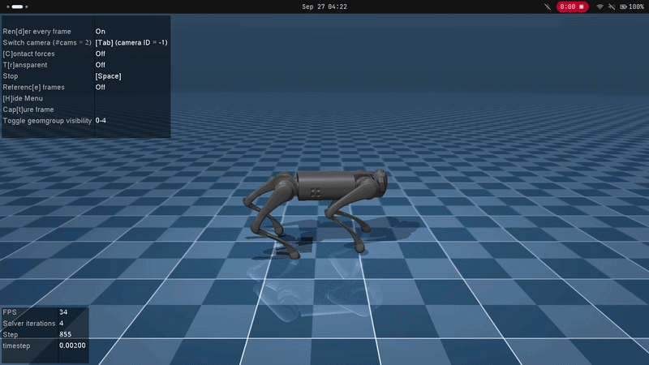
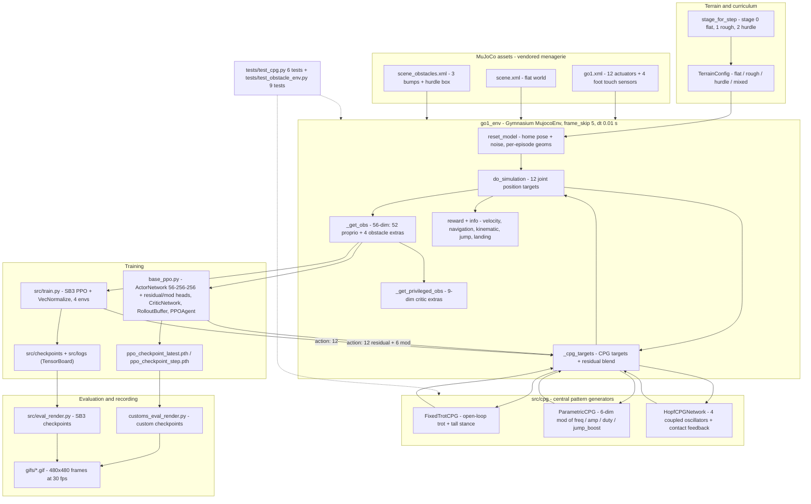

# deep-rl-and-cpg-ws

Deep-RL + CPG locomotion stack for the **Unitree Go1** quadruped in MuJoCo: an obstacle-aware Gymnasium environment, a three-stage curriculum (**flat → rough → hurdle jump**), and hybrid controllers pairing a Central Pattern Generator (CPG) with a PPO residual policy.

<p align="center">
  
</p>

Two runnable training stacks are provided:

| Stack | Entry point | Role | Checkpoints |
| :--- | :--- | :--- | :--- |
| Custom PPO | `base_ppo.py` | **Primary** — CPG stages + obstacle curriculum, custom actor/critic/loss | `ppo_checkpoint_*.pth` (repo root) |
| Stable-Baselines3 PPO | `src/train.py` | Secondary baseline — CPG `off`, `VecNormalize` | `src/checkpoints/your_run_name/` |

## System architecture



<details>
<summary>Plain-text version of the diagram (for viewers without Mermaid support)</summary>

```text
        mujoco_menagerie/unitree_go1                    src/cpg  (mode select)
 ┌────────────────────────────────────────┐      ┌───────────────────────────────────────┐
 │ go1.xml    12 actuators, 4 touch feet  │      │ FixedTrotCPG    open-loop trot        │
 │ scene.xml  flat world                  │      │ ParametricCPG   6-dim mod             │
 │ scene_obstacles.xml  bumps + hurdle    │      │ HopfCPGNetwork  4 oscillators + fb    │
 └────────────────┬───────────────────────┘      └────────────────┬──────────────────────┘
                  │ xml_file / terrain_config                     │ 12 joint targets
                  v                                               v
 ┌───────────────────────────────────────────────────────────────────────────────────────┐
 │ src/go1_env.py  go1_env(Gymnasium MujocoEnv, frame_skip=5, dt=0.01 s)                 │
 │   reset_model(): home pose + noise, _reposition_hurdle() / _reposition_bumps()        │
 │   step(): _cpg_targets(action) -> do_simulation() -> reward + info                    │
 │   _get_obs(): 56-dim (52 proprio + 4 hurdle)    _get_privileged_obs(): 9-dim extras    │
 └────────────┬────────────────────────────────────────────────────┬─────────────────────┘
              │ obs 56                                             │ obs 56
              v                                                    v
 ┌──────────────────────────────┐                  ┌──────────────────────────────────────┐
 │ base_ppo.py  (primary)       │                  │ src/train.py  (SB3 baseline)         │
 │  ActorNetwork 56->256->256   │                  │  PPO(MlpPolicy) + VecNormalize x4    │
 │  + residual(12) | mod(6)     │                  │  curriculum via GO1_STAGE            │
 │  CriticNetwork, RolloutBuffer│                  │  CheckpointCallback every 15k calls  │
 │  curriculum + form_weight    │                  └────────────────┬─────────────────────┘
 └──────────────┬───────────────┘                                   │
                │ ppo_checkpoint_*.pth                              │ src/checkpoints, src/logs
                v                                                   v
 ┌──────────────────────────────┐                  ┌──────────────────────────────────────┐
 │ customs_eval_render.py       │                  │ src/eval_render.py                   │
 │  + cv2 CPG overlay           │                  │  VecNormalize eval_mode              │
 └──────────────┬───────────────┘                  └────────────────┬─────────────────────┘
                └──────────►  gifs/*.gif  (imageio, 30 fps)  ◄───────┘
                        ▲
                        │ asserts obs 56, action 12/18, hurdle + bump randomization
              tests/test_cpg.py (6)  +  tests/test_obstacle_env.py (9)
```

</details>

Dataflow summary:

1. **Assets** — Vendored Go1 model (12 actuators, 4 `*_Touch` sensors); scene XMLs are kept static on disk.
2. **Terrain** — `TerrainConfig` + `stage_for_step()` select the scene and randomize hurdle/bump positions on each reset.
3. **Env** — `go1_env` converts actions into 12 joint targets (CPG base + residual), stepping MuJoCo at 100 Hz (`dt = 0.01 s`). Emits 56-dim obs, 9-dim privileged critic obs, reward, and diagnostics.
4. **CPG** — Supplies the nominal gait trajectory; policy provides residual offsets (and 6 modulation params for `parametric`/`hopf`).
5. **Training** — Two independent pipelines: custom PPO (`base_ppo.py`) and SB3 (`src/train.py`).
6. **Evaluation** — Renderers evaluate checkpoints and record rollouts to `gifs/` (see [Video & GIF capture](#video--gif-capture)).
7. **Tests** — Fast test suite validating shapes, obstacle randomization, and CPG kinematics without requiring policies.

## Status (verified in this working tree)

Run with the in-repo virtualenv interpreter (`./bin/python`, Python 3.14.4):

| Gate | Command | Result |
| :--- | :--- | :--- |
| CPG unit tests | `./bin/python tests/test_cpg.py` | **6/6 passed** |
| Env / obstacle integration tests | `./bin/python tests/test_obstacle_env.py` | **9/9 passed** |
| SB3 training launch | `./bin/python -m src.train` | Starts; detects stale 49-dim `VecNormalize` and refits 56-dim stats |
| Env spec probe | `go1_env` with each `cpg_mode` | `obs=(56,)`, `action=(12,)` or `(18,)`, `dt=0.01s`, `frame_skip=5`, `priv=(9,)` |
| Custom PPO launch | `./bin/python base_ppo.py` | Sanity check passes; resumes from `ppo_checkpoint_latest.pth` |
| Custom-PPO renderer | `./bin/python customs_eval_render.py` | Runs; resolves checkpoint, displays rollout and logs clearance/success |

> `pytest` is not installed; tests run directly as scripts via `python <test_file>` (see [Tests](#tests)).

## Repository layout

```
base_ppo.py                    Custom PPO (actor/critic, GAE buffer, curriculum, checkpointing)
customs_eval_render.py         Rollout renderer for the custom PPO checkpoints (GIF + CPG overlay)
src/
  go1_env.py                   go1_env: MuJoCo Gymnasium env (obs/reward/terrain/CPG wiring)
  train.py                     Stable-Baselines3 PPO baseline
  eval_render.py               SB3 evaluation + optional GIF
  terrain/config.py            TerrainConfig: hurdle/bump placement & per-episode randomization
  cpg/
    types.py                   CPGParams, OscillatorState, trot phase offsets & coupling
    fixed_trot.py              FixedTrotCPG — open-loop trot + tall stance
    parametric.py              ParametricCPG — policy-modulated freq/amp/phase/duty/jump_boost
    hopf.py                    HopfCPGNetwork — 4 coupled Hopf oscillators + contact feedback
tests/
  test_cpg.py                  CPG kinematics/stability (6 tests)
  test_obstacle_env.py         Env obs/reward/randomization integration (9 tests)
mujoco_menagerie/              Vendored MuJoCo Menagerie clone (unitree_go1 assets, own licenses)
gifs/                          Renderer output (empty in the committed tree; gitignored)
implementation_plan.md         Design doc: obstacles + staged CPG plan
balance_walk_analysis.md       Root-cause analysis of the balance/walk failures found in the CPG + reward
clean_up.md                    Log of the repo cleanup pass (archive-then-verify)
```

## Install / environment

Use the pre-configured virtual environment at the repository root (`./bin/python`), or create an equivalent one:

```bash
python3 -m venv .venv
source .venv/bin/activate
pip install "gymnasium[mujoco]==1.3.0" "stable-baselines3[extra]==2.9.0" \
            numpy scipy imageio torch
```

Environment package versions:

| Package | Version | Package | Version |
| :--- | :--- | :--- | :--- |
| Python | 3.14.4 | PyTorch | 2.13.0+cu130 |
| Gymnasium | 1.3.0 | NumPy | 2.5.1 |
| MuJoCo | 3.10.0 | SciPy | 1.18.0 |
| Stable-Baselines3 | 2.9.0 | ImageIO | 2.37.3 |
| OpenCV (optional) | 5.0.0 | | |

**Robot assets**: `mujoco_menagerie/unitree_go1/` supplies `go1.xml` (12 joint actuators, 4 `*_Touch` sensors), `scene.xml` (flat), and `scene_obstacles.xml` (3 bumps + hurdle). Obstacles are dynamically repositioned at runtime; scene files are never edited on disk.

> ⚠️ **Absolute paths**: `base_ppo.py`, `src/train.py`, `src/eval_render.py`, and `go1_env.__init__` hardcode `/home/plsh/rl_env2/...`. Update these paths if the repository is cloned elsewhere.

## The environment — `src/go1_env.py`

`go1_env(xml_file=..., terrain_config=TerrainConfig(...), cpg_mode=...)` extends `gymnasium.envs.mujoco.MujocoEnv`. With `frame_skip=5` and MuJoCo `0.002 s` simulation steps, the effective control step is `dt = 0.01 s` (100 Hz).

### Observation — 56-dim (`include_ext_obs=True`, the default)

| Block | Dim | Content |
| :--- | :--- | :--- |
| Position | 31 | Trunk `z` (1), roll/pitch/yaw (3), joint positions (12), gravity vector in body frame (3), previous residual actions (12) |
| Velocity | 18 | Trunk linear velocity (3), trunk angular velocity (3), joint velocities (12) |
| Target | 3 | Commanded body-frame velocity `[0.6, 0.0, 0.0]` |
| Obstacle extras | 4 | Normalized distance to hurdle `[-2, 10]`, hurdle height, trunk clearance over hurdle top, vertical velocity `vz` |

- **Legacy observation (52-dim)**: Set `include_ext_obs=False` to omit obstacle extras (identical to the first 52 dims of the default obs).
- **Privileged critic observation (9-dim)**: `_get_privileged_obs()` returns obstacle extras + 4 foot contact flags + trunk `z` for asymmetric critic training (`CriticNetwork.asymmetric`).

### Action

| `cpg_mode` | Action dim | Meaning |
| :--- | :--- | :--- |
| `off` | 12 | Direct joint positions: `home_qpos[7:] + action * 0.25` |
| `fixed_residual` | 12 | Fixed trot base + `action * residual_scale` |
| `parametric` | 18 | `[12 residual │ 6 mod]` — mod vector drives CPG parameters |
| `hopf` | 18 | `[12 residual │ 6 mod]` + foot-contact oscillator feedback |

Actions are bounded in `[-1, 1]`. Default `residual_scale` is `0.25` (`base_ppo.py` overrides this with a curriculum schedule).

### Reward

```python
reward = (
    3.0 * velocity_reward                     # exp(-4 * (vx_local - 0.6)^2)
    + 0.001                                   # survival bonus
    - 0.005 * mean((action12 - last12)^2)     # action smoothness
    - navigation_penalty                      # 0.5*vy^2 + 0.3*yaw_rate^2 + 0.5*heading_err^2
    - form_weight * kinematic_penalty
    + 2.0 * jump_bonus                        # approach + airtime/clearance (hurdle stages)
    + landing_bonus                           # clean first touchdown (<= landing_bonus_w)
    - 5.0 * hurdle_hit                        # penalty on hurdle contact
)
reward = clip(reward, -10.0, 10.0)
```

- **Kinematic penalty**: Penalizes diagonal trot desynchronization, foot clearance error, trunk orientation (roll/pitch), action magnitude, and joint velocities.
- **Form weight**: Governed by `form_weight` attribute (defaults to `0.0`; scheduled `0.2 → 1.0` in `base_ppo.py`).
- **Termination**: Ends if trunk height leaves `healthy_z_range = (0.25, 0.45)` (penalty `-2.0`), or on hurdle contact if `hurdle_hit_terminate=True`.
- **Diagnostics**: `info` dictionary provides breakdowns of velocity rewards, penalties, clearance, jump/landing bonuses, and active CPG state.

## CPG modes — `src/cpg/`

Leg ordering is **`[FR, FL, RR, RL]`** (hip, thigh, calf each). Diagonal pairs `(FL, RR)` and `(FR, RL)` operate in anti-phase.

| Mode | Class | Behaviour |
| :--- | :--- | :--- |
| `off` | – | Direct joint position targeting without CPG. |
| `fixed_residual` | `FixedTrotCPG` | Analytic trot around nominal tall stance `[0, 0.8, -1.5]` with smooth ease-in. Policy outputs residual offsets (`residual_scale`). Thigh swing-forward uses negative deltas (`THIGH_DIRS = [-1,-1,-1,-1]`). |
| `parametric` | `ParametricCPG` | Policy outputs 6 modulation values: frequency (1.5–3.0 Hz), thigh amplitude (±50%), calf amplitude (±50%), phase offset, duty cycle (0.3–0.7), and jump-boost blend. |
| `hopf` | `HopfCPGNetwork` | 4 coupled Hopf oscillators with Kuramoto trot synchronization and per-leg foot-contact phase feedback (`k_fb`). Supports live gain adjustment via `set_gains()`. |

## Terrain & curriculum — `src/terrain/config.py`

`TerrainConfig` manages dynamic obstacle placement across episodes without editing XML files:

- **Hurdle**: X-position randomized per reset in `[2.5, 5.0] m` (height `0.12 m`, thickness `0.08 m`, width `2.0 m`).
- **Bumps**: Positions jittered `±0.25 m`; heights scaled `0.5×–1.5×` during rough and hurdle stages.

Curriculum stages:

| Stage | World | Terrain mode | Description |
| :--- | :--- | :--- | :--- |
| 0 | `scene.xml` | `flat` | Flat ground locomotion baseline |
| 1 | `scene_obstacles.xml` | `rough` | Terrain with 3 low bumps |
| 2 | `scene_obstacles.xml` | `hurdle` | Bumps + hurdle jump |

## Training

### Custom PPO (primary) — `base_ppo.py`

```bash
./bin/python base_ppo.py                 # default CPG mode: fixed_residual
GO1_CPG_MODE=hopf ./bin/python base_ppo.py
```

- **Architecture**: Shared trunk `Linear(state_dim→256) → Tanh → Linear(256→256) → Tanh` feeding a 12-dim residual head (plus a 6-dim mod head for `parametric`/`hopf`). Critic supports symmetric (56-dim) or asymmetric (65-dim, includes privileged obs) inputs.
- **PPO Setup**: Buffer size 2048, 5 epochs, minibatch 64, `clip_epsilon=0.2` (0.15 in hurdle stage), grad-norm clip 0.5, linear LR decay from `1e-4`.
- **Curriculum**:
  - Stage 0 (< 1.5M steps): Flat ground, residual scale `0.05`.
  - Stage 1 (1.5M–3.0M steps): Rough ground, residual scale `0.15`.
  - Stage 2 (> 3.0M steps): Hurdle terrain, residual scale `0.15`.
  - `form_weight`: Scheduled from `0.2` (0–1M steps) to `1.0` (at 2M+ steps).
- **Checkpoints**: Saves `ppo_checkpoint_latest.pth` and step snapshots every 10 updates. Automatically resumes from latest checkpoint if available.
- **Sanity Check**: Runs a 200-step random policy rollout before training to verify shapes and environment stepping.

> [!NOTE]
> Shipped root checkpoints (`ppo_checkpoint_*.pth`) were trained prior to the thigh sign fix (see `balance_walk_analysis.md`). Starting a fresh Stage-0 run is recommended.

### Stable-Baselines3 PPO (secondary) — `src/train.py`

```bash
./bin/python -m src.train                # run as module from repo root
GO1_STAGE=2 ./bin/python -m src.train
```

- **Setup**: Trains SB3 `PPO("MlpPolicy")` with 4 parallel environments wrapped in `VecNormalize` for 2.5M timesteps.
- **Hyperparameters**: `n_steps=512`, `batch_size=64`, `n_epochs=10`, `lr=1e-4`, `gamma=0.99`, `gae_lambda=0.95`.
- **Checkpoints**: Saves `rl_model_<env_steps>_steps.zip` and `latest_vecnormalize.pkl` every 60k env steps to `src/checkpoints/<RUN_NAME>/`.
- **Logging**: TensorBoard logs written to `src/logs/<RUN_NAME>/` (`./bin/tensorboard --logdir src/logs`).
- **Notes**: Must be run with `-m src.train` from repo root. Uses `cpg_mode=off` by default.

### Environment-variable reference

| Var | Used by | Default | Effect |
| :--- | :--- | :--- | :--- |
| `GO1_CPG_MODE` | `base_ppo.py`, `src/train.py` | `fixed_residual` (`off` for SB3) | CPG mode: `off`, `fixed_residual`, `parametric`, or `hopf` |
| `GO1_RESIDUAL_SCALE` | `base_ppo.py` | `0.10` | Action residual scale (only when `CPG_MODE=off`) |
| `GO1_CPG_K_FB` | `base_ppo.py` | `0.5` | Hopf foot-contact feedback gain (stages ≥ 1) |
| `GO1_CPG_COUPLING` | `base_ppo.py` | `2.0` | Hopf Kuramoto inter-leg coupling strength |
| `GO1_LANDING_BONUS_W` | `base_ppo.py` | `1.0` | Weight for landing stability bonus |
| `GO1_HURDLE_HIT_TERMINATE` | `base_ppo.py` | `0` | Terminate episode immediately on hurdle contact (`1` to enable) |
| `GO1_STAGE0_END` | `base_ppo.py` | `1500000` | Step threshold for flat → rough transition |
| `GO1_STAGE1_END` | `base_ppo.py` | `3000000` | Step threshold for rough → hurdle transition |
| `GO1_STAGE` | `src/train.py` | `0` | Curriculum stage: `0` (flat), `1` (rough), `2` (hurdle) |
| `GO1_FRESH_VECNORM` | `src/train.py` | `0` | Force fresh `VecNormalize` stats (`1` required for 56-dim runs) |
| `GO1_EVAL_STAGE` | Eval renderers | `hurdle` / `flat` | Target terrain for evaluation (`flat` or `hurdle`) |
| `GO1_EVAL_XML` | `src/eval_render.py` | derived | Override evaluation XML scene path |
| `GO1_SAVE_GIF` | `src/eval_render.py` | `"0"` | Inverted flag: `"0"`/unset enables GIF saving, any other value disables |

## Evaluation & rendering

By default, evaluation scripts use `render_mode="human"` for interactive display. To record GIFs or videos, use `render_mode="rgb_array"` (see [Video & GIF capture](#video--gif-capture)).

### Evaluating Custom PPO

```bash
./bin/python customs_eval_render.py       # GO1_EVAL_STAGE=hurdle (default) or flat
```

- Automatically loads `ppo_checkpoint_latest.pth`, detects checkpoint dimensions (`state_dim`, `action_dim`), and infers `cpg_mode`.
- Renders rollouts with an optional OpenCV telemetry HUD (leg swing bars, CPG phase, obstacle clearance).
- Evaluates up to 20 episodes and logs hit rate, jump success, and mean clearance.

### Evaluating SB3 Baseline

```bash
./bin/python -m src.eval_render           # GO1_EVAL_STAGE=flat or hurdle
```

- Disables normalization updates (`VecNormalize.training = False`) and tracks the robot trunk.
- Evaluates up to 20 episodes and reports hurdle clearance metrics.

> [!WARNING]
> Shipped SB3 artifacts use legacy 49-dim normalization stats and will fail with a shape mismatch against the current 56-dim environment. Retrain with `./bin/python -m src.train` before running this evaluator.

## Video & GIF capture

Rendered media is gitignored (`gifs/`, `*.gif`, `*.mp4`). To track a recording, use `git add -f gifs/<filename>`.

### Capture rules (all verified in this workspace)

| Property | Detail |
| :--- | :--- |
| Frame format | `480x480x3 uint8` at `dt = 0.01 s` (100 fps simulation step, recorded at 30 fps) |
| Render mode | Must use `render_mode="rgb_array"` (`render_mode="human"` opens a window and returns `None`) |
| Instantiation | Instantiate `go1_env(..., render_mode="rgb_array")` directly or call `env.unwrapped.render()` to bypass passive checkers |
| Dependencies | `imageio` + `Pillow` are installed for GIF encoding; MP4 requires `imageio-ffmpeg` or system `ffmpeg` |
| File size | ~15 MB per 150 frames at 480×480; keep clips short or downsample frames |

### Recipe 1 — custom PPO policy → GIF (verified end-to-end)

```python
# record_gif.py — run: ./bin/python record_gif.py
import imageio, torch
from base_ppo import ActorNetwork
from src.go1_env import go1_env
from src.terrain.config import TerrainConfig

ckpt = torch.load("ppo_checkpoint_latest.pth", map_location="cpu")
actor = ActorNetwork(int(ckpt["state_dim"]), 12, max(0, int(ckpt["action_dim"]) - 12))
actor.load_state_dict(ckpt["actor_state_dict"])
actor.eval()

env = go1_env(
    xml_file="/home/plsh/rl_env2/mujoco_menagerie/unitree_go1/scene_obstacles.xml",
    terrain_config=TerrainConfig(mode="hurdle"),
    cpg_mode=ckpt.get("cpg_mode", "off"),
    residual_scale=0.10,
    render_mode="rgb_array",
)
obs, _ = env.reset()
frames = []
for _ in range(150):  # 1.5 seconds at dt = 0.01 s
    with torch.no_grad():
        action, _, _ = actor(torch.tensor(obs, dtype=torch.float32).unsqueeze(0))
    obs, reward, terminated, truncated, info = env.step(action.numpy().flatten())
    frames.append(env.render())
    if terminated or truncated:
        obs, _ = env.reset()
env.close()

imageio.mimsave("gifs/go1_hurdle_fixed_residual.gif", frames, fps=30, loop=0)
print(f"Saved {len(frames)} frames to gifs/go1_hurdle_fixed_residual.gif")
```

> **Note**: `cpg_mode` must match the checkpoint (12-dim action for `off`/`fixed_residual`, 18-dim for `parametric`/`hopf`).

### Recipe 2 — SB3 policy → GIF

In `src/eval_render.py`, configure the environment to return pixel arrays:

```python
eval_env = DummyVecEnv([lambda: go1_env(xml_file=EVAL_XML, render_mode="rgb_array")])
```

Run `./bin/python -m src.eval_render` (requires a retrained 56-dim SB3 checkpoint).

### Recipe 3 — MP4 / longer clips

Install ffmpeg support:

```bash
pip install imageio-ffmpeg
```

```python
# Save as H.264 MP4
imageio.mimsave("gifs/go1_rollout.mp4", frames, fps=30, codec="libx264")

# Reduce file size via 2x downsampling (240x240)
small_frames = [f[::2, ::2] for f in frames]
```

## Tests

Run the test suite directly with the virtualenv interpreter:

```bash
./bin/python tests/test_cpg.py            # 6 unit tests (CPG dynamics)
./bin/python tests/test_obstacle_env.py   # 9 integration tests (Env & obstacles)
```

- **`tests/test_cpg.py`**: Verifies trot antisymmetry, swing thigh signs, parameter clamping, Hopf stability/phase locking, and contact feedback gains.
- **`tests/test_obstacle_env.py`**: Verifies 56-dim/52-dim observations, obstacle pose randomization, jump/landing reward calculations, hurdle collision termination, and step stability.

## Artifacts & file conventions

| Path | Produced by | Contents |
| :--- | :--- | :--- |
| `ppo_checkpoint_latest.pth`, `ppo_checkpoint_<step>.pth` | `base_ppo.py` | Custom PPO actor/critic/optimizer state + metadata |
| `src/checkpoints/your_run_name/` | `src/train.py` | SB3 `rl_model_*_steps.zip`, `latest_vecnormalize.pkl`, `final*` |
| `src/logs/your_run_name/` | `src/train.py` | TensorBoard event files |
| `gifs/` | Renderers | Rollout GIFs (gitignored) |

All generated artifacts (`*.pth`, `*.zip`, `*.pkl`, `src/logs/`, `gifs/`) are gitignored to keep the repository lightweight.

## Known limitations & gotchas

1. **Hardcoded absolute paths**: `base_ppo.py`, `src/train.py`, `src/eval_render.py`, and `go1_env` assume `/home/plsh/rl_env2`.
2. **`form_weight` defaults to 0.0**: Kinematic penalties (trot rhythm, clearance, posture) are inactive unless `form_weight` is set by the training loop (`base_ppo.py` manages this schedule).
3. **Stale SB3 checkpoints**: Shipped SB3 checkpoints use 49-dim observation statistics; `src/eval_render.py` will raise a shape error until fresh 56-dim models are trained via `src.train`.
4. **Pre-fix root checkpoints**: Checkpoints at the root were trained before the thigh direction fix; start fresh from Stage 0 for optimal gait convergence (see `balance_walk_analysis.md`).
5. **No `pytest` binary**: Run tests directly as scripts via `./bin/python tests/<test_file>.py`.
6. **Inverted `GO1_SAVE_GIF` flag**: In `src/eval_render.py`, setting `GO1_SAVE_GIF="0"` enables GIF saving, while any other value disables it.
7. **Headless frame capture**: Evaluation scripts default to `render_mode="human"` (returns `None`). Switch to `render_mode="rgb_array"` to save GIFs/videos.
8. **CPG modes**: `parametric` and `hopf` modes have unit test coverage, but pre-trained checkpoints are only provided for `fixed_residual`.
9. **Vendored assets**: Do not edit `mujoco_menagerie/` XML files directly; adjust geometry dynamically at runtime via `TerrainConfig`.

## Further reading

| Document | Contents |
| :--- | :--- |
| `implementation_plan.md` | Architecture design: obstacle handling, staged CPG integration, test specifications |
| `balance_walk_analysis.md` | Analysis and fixes for locomotion stability and CPG joint sign alignment |

## Credits & license

- **Robot Model & Assets**: Vendored from [MuJoCo Menagerie](https://github.com/google-deepmind/mujoco_menagerie) Unitree Go1 (BSD-3-Clause, © Unitree Robotics).
- **Libraries**: Built with [Gymnasium](https://gymnasium.farama.org/), [MuJoCo](https://mujoco.org/), [Stable-Baselines3](https://stable-baselines3.readthedocs.io/), and [PyTorch](https://pytorch.org/).
