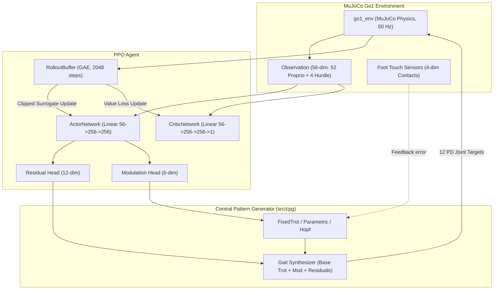

# PPO with CPG

## About the Application of the Algorithm
Proximal Policy Optimization (PPO) is applied as an on-policy residual controller paired with a Central Pattern Generator (CPG) framework for the Unitree Go1 quadruped robot. Instead of learning raw actuator positions from scratch, the policy outputs residual joint adjustments and gait modulation parameters to stabilize and adapt the locomotion cycle across complex environments.

The system supports multiple CPG formulations:
- **Fixed Residual (`fixed_residual`)**: An open-loop trot oscillator generates canonical diagonal trot trajectories with a tall stance; the policy outputs 12 joint angle residuals scaled by a residual gain.
- **Parametric CPG (`parametric`)**: The policy outputs an 18-dimensional action comprising 12 joint residuals and 6 gait modulation parameters (`[d_freq, d_thigh_amp, d_calf_amp, d_phase_offset, duty, jump_boost]`). This enables adaptive frequency (1.5–3.0 Hz), amplitude adjustments, and a symmetric crouch-tuck for obstacle clearance.
- **Hopf/Kuramoto CPG (`hopf`)**: Employs 4 coupled non-linear Hopf oscillators with Kuramoto phase coupling and foot-contact feedback error (`actual - expected contact`). Ground reaction forces dynamically pull oscillator phases toward stance or swing to recover from external disturbances and rough terrain.
- **Off (`off`)**: Baseline mode where actions directly offset the default nominal joint positions.

Training follows a 3-stage curriculum (Flat → Rough → Hurdle), scaling residual authority from 0.05 on flat ground to 0.15 on rough terrain and hurdles.

## Folder Info

| File / Folder | Description |
| :--- | :--- |
| `base_ppo.py` | Core custom PPO implementation containing `ActorNetwork`, `CriticNetwork`, `RolloutBuffer` (GAE), curriculum environment builder, and training loop. |
| `train.py` | Secondary baseline training script using Stable-Baselines3 (SB3) PPO with `VecNormalize` (defaulting to CPG off). |
| `customs_eval_render.py` | Interactive evaluation script supporting headless GIF generation and real-time OpenCV HUD with per-leg CPG swing indicators. |

## System Architecture

<b>System Architecture</b>

## Dataflow Summary

1. **State Observation**: The environment extracts a 56-dimensional vector (torso height/orientation, joint positions/velocities, gravity vector, previous actions, and hurdle-relative distances).
2. **Action Inference**: The PPO `ActorNetwork` maps observations to Gaussian distributions over 18 actions (12 residual offsets + 6 CPG modulation parameters).
3. **CPG Modulation & Integration**:
   - In `parametric` mode, the 6 mod parameters dynamically update oscillator frequency, amplitudes, duty factor, and tuck/boost.
   - In `hopf` mode, foot contact sensor readings are compared against expected trot phases, injecting contact error feedback directly into the Kuramoto coupling equations.
4. **Target Actuation**: Residual offsets (scaled by `0.05`–`0.15`) are added to the CPG joint targets, producing 12 position commands delivered to MuJoCo actuators.
5. **Optimization**: Trajectories are accumulated in a 2048-step `RolloutBuffer`, where Generalized Advantage Estimation (GAE) calculates advantages for clipped surrogate policy and value function updates.

## Observations

- **Stability**: Residual learning atop CPG trot priors prevents initial collapse, accelerating early gait acquisition and preventing falling during early exploration.
- **Sample Requirements**: Being an on-policy method, PPO discards rollout trajectories after each batch update, requiring ~13.5M environment steps to achieve complete curriculum mastery.
- **Curriculum Adaptation**: Increasing residual authority dynamically (`0.05` on flat, `0.15` on rough/hurdles) preserves steady trot stability while giving the policy sufficient control authority to clear obstacles.
