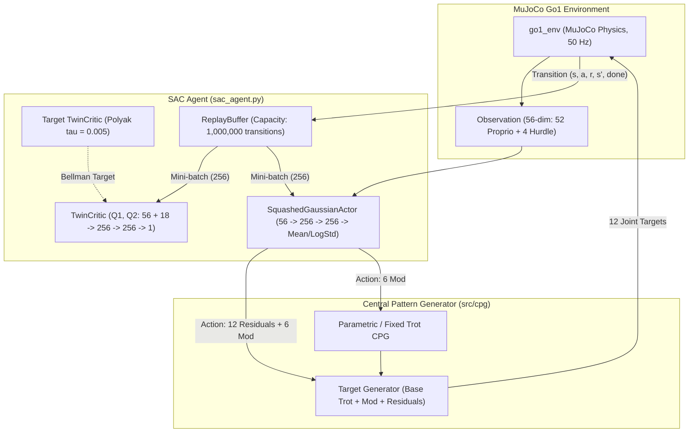

# SAC with CPG

## About the Application of the Algorithm
Soft Actor-Critic (SAC) is an off-policy maximum-entropy actor-critic algorithm applied to the Unitree Go1 quadruped. SAC pairs continuous entropy regularization with high sample efficiency, making it well-suited for learning contact-rich quadruped locomotion over varying terrain.

CPG integration provides a periodic locomotion prior, while SAC learns to modulate the gait and supply compensatory joint torques:
- **Parametric CPG (`parametric`)**: Primary mode where the policy outputs an 18-dimensional action (12 joint residuals + 6 gait modulation parameters). The policy modulates frequency (1.5–3.0 Hz), leg swing amplitude, duty cycle, and obstacle crouch-tuck (`jump_boost`).
- **Fixed Residual (`fixed_residual`)**: 12-dimensional action where the policy supplies joint offsets over a fixed 2.0 Hz diagonal trot generator.
- **Hopf/Kuramoto CPG (`hopf`)**: Coupled non-linear oscillator network with foot-contact perturbation recovery.

Training utilizes an automated 3-stage curriculum (0: Flat, 1: Rough Bumps, 2: Hurdles) spanning 4,500,000 timesteps (1.5M timesteps per stage). Replay transitions are preserved across stage transitions to retain gait fundamentals while adapting to new obstacles.

## Folder Info

| File / Folder | Description |
| :--- | :--- |
| `sac_agent.py` | SAC algorithm core: `SquashedGaussianActor` (tanh-bounded continuous actions), `TwinCritic` (double Q-learning), and `ReplayBuffer` (1M capacity). |
| `train_sac.py` | End-to-end curriculum training orchestrator with warmup buffer seeding, stage boundaries (1.5M, 3.0M, 4.5M total), evaluation protocols, and checkpointing. |
| `simulate_sac.py` | Standalone visualization and rollout renderer with OpenCV HUD telemetry (CPG phase, leg swing indicators, velocities) and GIF exporter. |
| `checkpoints/` | Storage for trained policy checkpoints (`latest_checkpoint.pth`, `best_checkpoint.pth`, and run-specific models). |
| `logs/` | TensorBoard event files, training curve plots (`sac_training_curves.png`), and training log files (`train_sac.log`). |

## System Architecture

<b>System Architecture</b>

## Dataflow Summary

1. **State Observation**: The 56-dimensional environment observation vector is ingested by the `SquashedGaussianActor`.
2. **Continuous Action Sampling**: The actor network outputs mean and log standard deviation, producing an 18-dimensional action bounded in `[-1, 1]` via tanh squashing.
3. **CPG Target Computation**:
   - 6 modulation values adjust CPG frequency, thigh/calf amplitudes, phase offsets, duty factor, and tuck/boost.
   - The CPG calculates nominal joint positions for the trot cycle.
   - 12 residual actions (scaled by `0.10`–`0.15`) are added to the nominal positions.
4. **Execution & Buffer Storage**: Actuator targets are simulated in MuJoCo. Transitions `(s, a, r, s', done)` are deposited into the 1,000,000-step `ReplayBuffer`.
5. **Off-Policy Gradient Update**: Uniform batches of 256 transitions are sampled. The `TwinCritic` evaluates Clipped Double Q-targets to mitigate value overestimation, and the actor is updated using reparameterized policy gradients with automated entropy regularization. Target networks are smoothly updated via Polyak averaging ($\tau = 0.005$).

## Quantized Results

| Metric | SAC |
| :--- | :--- |
| **Total Timesteps (scheduled)** | 3,000,000 |
| **Total Episodes** | 4,007 |
| **Peak Evaluation Return** | **2,917.71** |
| **Max Episode Return** | 2,918.91 |
| **Mean Episode Return** | 1,841.46 |
| **Stage 0 Mean Return (Flat)** | **2,275.55** |
| **Stage 1 Mean Return (Rough)** | 1,620.16 |
| **Stage 2 Mean Return (Hurdle)** | 1,691.19 |
| **Steps to Return ≥ 2,000** | 124,017 |
| **Steps to Return ≥ 2,500** | 272,676 |

## Observations

- **Sample Efficiency**: SAC reaches a moving-average return ≥ 2,000 in 124,017 steps—roughly **1.2× faster than PPO** (143,974 steps). Across all three benchmarked algorithms, SAC ranks second behind TD3 (40,473 steps) at this milestone.
- **Strongest Early-Stage Performance**: SAC achieves the highest mean return on flat terrain (Stage 0: **2,275.55**), outperforming both TD3 (2,177) and PPO (324). The stochastic policy explores the contact-rich flat terrain more broadly, building a stronger locomotion foundation.
- **Replay Buffer Advantage**: Retaining 1M past transitions allows continuous gradient updates per environment step, enabling reliable stage 0 survival within ~240k steps (vs ~1.2M for PPO).
- **Curriculum Robustness**: Preserving the replay buffer across stage transitions lets SAC maintain stable base trotting while adapting to rough terrain and hurdle clearances, reaching a record evaluation return of **2,917.71** with 0% fall rate.
