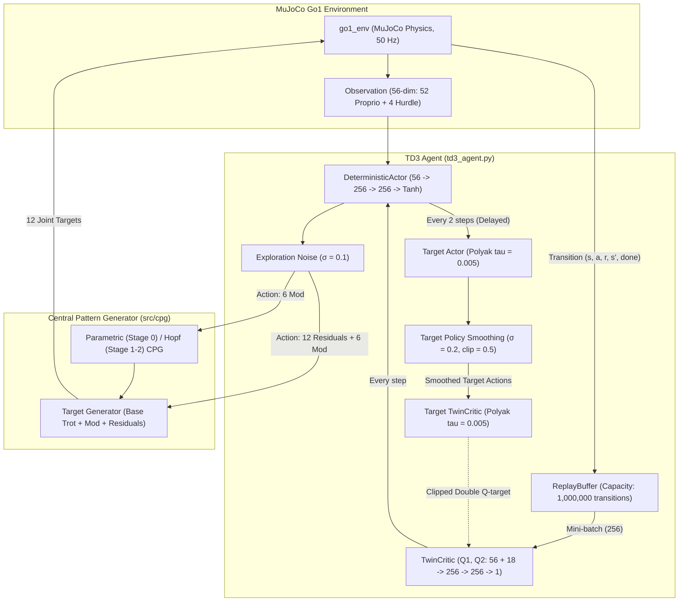

# TD3 with CPG

## About the Application of the Algorithm
Twin Delayed Deep Deterministic Policy Gradient (TD3) is an off-policy, deterministic actor-critic algorithm applied to the Unitree Go1 quadruped. TD3 addresses the overestimation bias of DDPG with three key improvements: Clipped Double Q-learning (Twin Critic), Target Policy Smoothing (Gaussian noise on target actions), and Delayed Policy Updates (actor updated every 2 critic steps). Combined with a CPG locomotion prior, TD3 learns to modulate and compensate a periodic gait across flat terrain, rough bumps, and hurdle obstacles.

CPG integration provides a structured periodic prior while TD3 adapts the gait and supplies compensatory joint corrections:
- **Parametric CPG → Hopf CPG (`parametric_then_hopf`)**: Default mode. Stage 0 uses `parametric` CPG (18-dim: 12 joint residuals + 6 gait modulation parameters), then transitions to `hopf` CPG for Stages 1 & 2, leveraging Kuramoto phase coupling and foot-contact feedback.
- **Fixed Residual (`fixed_residual`)**: 12-dimensional action where the deterministic actor supplies joint offsets over a fixed 2.0 Hz diagonal trot.
- **Parametric CPG (`parametric`)**: Policy modulates frequency (1.5–3.0 Hz), swing amplitude, duty cycle, and obstacle tuck (`jump_boost`).
- **Hopf/Kuramoto CPG (`hopf`)**: Coupled non-linear oscillators with foot-contact perturbation feedback for terrain recovery.

Training runs a 3-stage curriculum over 10,500,000 timesteps (3.5M per stage): Stage 0 Flat → Stage 1 Rough Bumps → Stage 2 Hurdles. The replay buffer is preserved across stage transitions, retaining prior locomotion knowledge.

## Folder Info

| File / Folder | Description |
| :--- | :--- |
| `td3_agent.py` | TD3 algorithm core: `DeterministicActor` (tanh-bounded continuous actions), `TwinCritic` (double Q-learning), and `ReplayBuffer` (1M capacity). |
| `train_td3.py` | End-to-end curriculum training orchestrator with warmup buffer seeding, stage boundaries (3.5M, 7.0M), exploration noise schedule, evaluation protocols, and checkpointing. |
| `td3_simulate.py` | Standalone visualization and rollout renderer supporting all curriculum stages with OpenCV HUD telemetry (CPG phase, leg swing indicators) and GIF export. |
| `checkpoints/` | Storage for trained policy checkpoints (`latest_checkpoint.pth`, `best_checkpoint.pth`, and run-specific models). |
| `logs/` | TensorBoard event files and training log files. |

## System Architecture

<b>System Architecture</b>

## Dataflow Summary

1. **State Observation**: The 56-dimensional observation (torso height/orientation, joint positions/velocities, gravity vector, previous actions, hurdle-relative distances) is fed to the `DeterministicActor`.
2. **Deterministic Action + Exploration Noise**: The actor outputs a continuous action bounded in `[-1, 1]`. During training, Gaussian noise (σ = 0.1) is added for exploration and clipped to `[-1, 1]`.
3. **CPG Target Computation**:
   - 6 modulation values adjust CPG frequency, thigh/calf amplitudes, phase offsets, and duty factor.
   - 12 residual actions (scaled by `0.10`–`0.15`) are added to nominal CPG joint positions.
4. **Execution & Buffer Storage**: MuJoCo simulates actuator targets. Transitions `(s, a, r, s', done)` are stored in the 1,000,000-step `ReplayBuffer`.
5. **Off-Policy TD3 Update**:
   - **Critic Update (every step)**: Uniform batches of 256 transitions are sampled. Target Policy Smoothing adds clipped Gaussian noise (σ = 0.2, clip = 0.5) to target actor actions. The Clipped Double Q-target `min(Q1_target, Q2_target)` forms the Bellman backup for the critic MSE loss.
   - **Actor Update (every 2 steps)**: The deterministic policy is updated by ascending the Q1 gradient: `−∇ Q1(s, π(s))`.
   - **Soft Target Updates**: Both actor and critic target networks are updated via Polyak averaging (τ = 0.005) only when the actor is updated.

## Quantized Results

| Metric | TD3 |
| :--- | :--- |
| **Total Timesteps (scheduled)** | 10,500,000 |
| **Peak Evaluation Return** | **2,933.20** |
| **Stage 0 Mean Return (Flat)** | 2,177.08 |
| **Stage 1 Mean Return (Rough)** | 1,504.29 |
| **Stage 2 Mean Return (Hurdle)** | **2,364.01** |
| **Steps to Return ≥ 2,000 (aligned)** | **40,473** |
| **Steps to Return ≥ 2,500 (aligned)** | 61,114 |

## Observations

- **Fastest to 2,000 Return**: TD3 reaches a moving-average return ≥ 2,000 in only ~40k aligned steps—roughly 3× faster than SAC (124k) and 3.6× faster than PPO (144k). The combination of a deterministic policy and replay buffer allows very rapid early learning.
- **Target Policy Smoothing**: Adding bounded noise to target actions during critic updates acts as a regulariser, preventing the policy from exploiting sharp peaks in the Q-function and stabilising gait across varying terrain.
- **Delayed Actor Updates**: Updating the actor every 2 critic steps ensures the critic is sufficiently accurate before the policy gradient signal is used, reducing variance and improving stability on contact-rich quadruped locomotion.
- **Hurdle Stage Performance**: TD3 achieves its highest mean stage return in Stage 2 (Hurdles, 2364) despite training there last, demonstrating strong transfer from the Flat and Rough stages and effective CPG mode switching (parametric → hopf).
