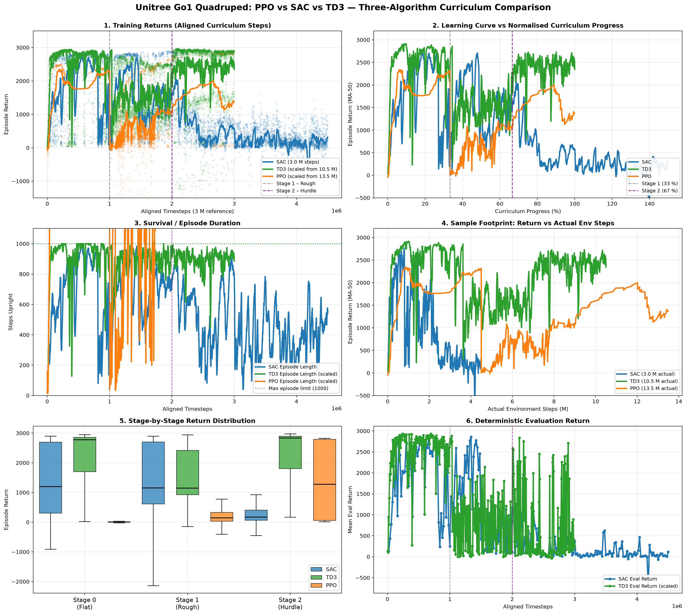

# Quadruped Locomotion Benchmark: PPO vs SAC vs TD3 Three-Algorithm Analysis

This benchmark compares the performance, sample efficiency, and curriculum progression of **Proximal Policy Optimization (PPO)**, **Soft Actor-Critic (SAC)**, and **Twin Delayed DDPG (TD3)** on the Unitree Go1 quadruped.

## 1. Key Metrics Summary

| Metric | SAC (Off-Policy) | TD3 (Off-Policy) | PPO (On-Policy, Raw) | PPO (Scaled to 3.0M) |
| :--- | :--- | :--- | :--- | :--- |
| **Scheduled Timesteps** | 3,000,000 | 10,500,000 | 13,500,000 | 2,998,291 |
| **Peak Evaluation Return** | 2,917.71 | **2,933.20** | N/A (Online only) | N/A (Online only) |
| **Stage 0 Mean Return (Flat)** | **2,275.55** | 2,177.08 | 323.54 | 323.54 |
| **Stage 1 Mean Return (Rough)** | **1,620.16** | 1,504.29 | 273.88 | 273.88 |
| **Stage 2 Mean Return (Hurdle)** | 1,691.19 | **2,364.01** | 1,531.31 | 1,531.31 |
| **Steps to Return ≥ 2,000 (aligned)** | 124,017 | **40,473** | 143,974 | 145,448 |
| **Steps to Return ≥ 2,500 (aligned)** | 272,676 | **61,114** | N/A | N/A |

> Aligned steps map all three curricula to a common 3 M-step reference axis
> (PPO × 0.222, TD3 × 0.286).

## 2. Analytical Findings

### A. Sample Efficiency & Learning Speed
- **TD3 converges fastest**: it reaches a moving-average return ≥ 2,000 in only ~40k aligned steps—roughly **3× faster than SAC** (124k) and **3.6× faster than PPO** (144k). The deterministic actor eliminates the entropy-induced exploration variance of SAC, enabling rapid early Q-function bootstrapping.
- **SAC vs PPO**: SAC is ~1.2× more sample-efficient than PPO at the 2,000-return milestone, confirming the replay-buffer advantage of off-policy methods over on-policy rollout discarding.

### B. Curriculum Stage Adaptation
- **Stage 0 (Flat Ground)**: SAC leads with the highest mean return (2,275), followed closely by TD3 (2,177). PPO lags significantly (324) due to on-policy sample constraints.
- **Stage 1 (Rough Bumps)**: Both off-policy algorithms maintain stable locomotion. SAC edges TD3 (1,620 vs 1,504) as its stochastic policy better explores rougher contact distributions.
- **Stage 2 (Hurdles)**: TD3 achieves the highest mean return (2,364) despite training on hurdles last, demonstrating effective knowledge transfer via replay buffer and CPG mode switching (parametric → hopf). SAC reaches 1,691, while PPO recovers to 1,531 after its slow start.

### C. Peak Evaluation Performance
- TD3 achieves the highest deterministic evaluation peak (**2,933.20**), narrowly above SAC (2,917.71). The deterministic policy of TD3 avoids the stochastic entropy overhead of SAC during rollout, yielding a sharper upper bound on evaluation returns.

### D. Conclusion & Recommendations
1. **TD3 is recommended when rapid early convergence is the priority**—its deterministic actor + target smoothing reaches high returns with minimal aligned environment steps.
2. **SAC excels on early-stage flat terrain** and provides a robust stochastic policy useful for sim-to-real transfer (natural action diversity).
3. **PPO remains viable for massively vectorised simulation** where many parallel environments make on-policy collection cheap, and Q-function overestimation is a concern.
